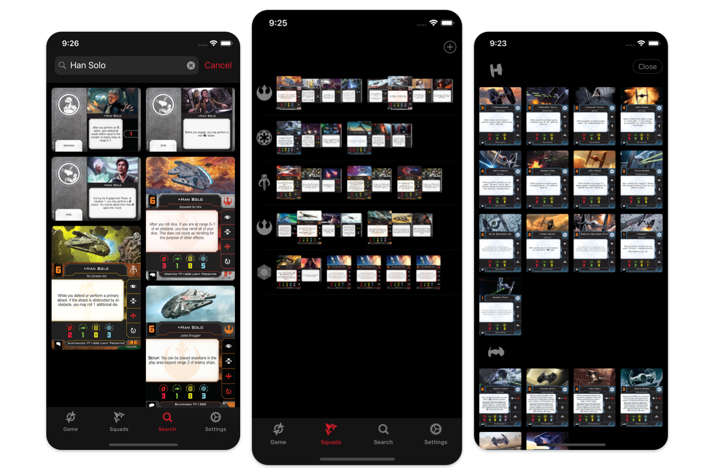

# X-Squad
X-Squad is an open source iOS app for building squads for [X-Wing: The Miniatures Game (Second Edition)](https://www.fantasyflightgames.com/en/products/x-wing-second-edition/). It's a native Swift app built using mostly first-party Apple tools and APIs.

## Getting Started

1. Clone the repo (including the two submodules).
2. Install [Carthage](https://github.com/Carthage/Carthage) dependencies.
	- `$ brew install carthage` (if you don't have Carthage installed)
	- `$ carthage bootstrap` (run this in the root of the codebase)
3. Open `X-Squad.xcodeproj`
4. Run the app

## Contributing
Raise an issue for any feedback or bugs. If you want to contribute, feel free to fork this repo and create a pull request.

## Technical Overview
The app is built using Swift and supports both iPhone and iPad. The app is built to work offline first. It persistantly stores user's squads locally, and when the user has an internet connection it backs them up on iCloud, and syncs them accross multiple devices.

### X-Wing Data
Data for all the X-Wing cards is synced from [X-Wing Data 2](https://github.com/guidokessels/xwing-data2) by including this as a submodule in the codebase. The entirety of this data collection is bundled with the app when it's built (through a build phase) so that the app can work offline from the first time it's opened.

The app then loads all card data from the bundled JSON files using Swift's `Codable` to convert these into in-memory objects (see `DataStore.loadShips` and `DataStore.loadUpgrades`).

Everytime the app is opened it queries the app's public iCloud database for a `Data` object, and if there's a more recent one available it will download a zip attached to that record, unzip it, and use that for card data going forward (see `DataStore.updateIfNeeded`). This allows card data to be updated and quickly distributed over-the-air whenever it changes. The app is designed so that if the downloaded data is incompatible with the app in any way, it will fallback to the data bundled with the app.

### Persisting Squads
The `Squad` object used throughout the app is fully `Codable`. Whenever a change is made to a Squad, all of the user's squads are encoded and saved to a local file on the device (see `SquadStore.save`). When the app is launched, this file is then decoded to load the persisted squads (see `SquadStore.loadSquads`).

Whenever a change is made to a squad, this is then synced to iCloud (see `SquadCloudStore.saveSquad`). Squads are also synced periodically with iCloud whenever the app is opened (see `SquadCloudStore.syncRecordsIfNeeded`), and changes to squads on iCloud are quickly reflected across devices by subscribing to notifications (see `SquadCloudStore.subscribeToChanges` and `SquadCloudStore.handleNotification`).

## Disclaimer
X-Wing: The Miniatures Game is a trademark of [Fantasy Flight Games](http://fantasyflightgames.com/).

The X-Squad app is in no way affiliated with or endorsed by Fantasy Flight Games or any of its subsidiaries, employees, or associates. The creator of this app offers no suggestion that the content presented here is "official" or produced or sanctioned by the owner or any licensees of X-Wing: The Miniatures Game or Star Wars trademarks. Images displayed in this app are copyrighted to Fantasy Flight Games, or to the creator of the image.

